# TeamEventPro User Guide

## Guide Contents

- [About TeamEventPro](#1-about-teameventpro)
- [Getting Started](#getting-started)
- [Command Fundamentals](#command-fundamentals)
  - [Prefix reference](#3-prefix-reference)
  - [Index and list behavior](#4-index-and-list-behavior)
  - [Common mistakes and quick fixes](#5-common-mistakes-and-quick-fixes)
- [Common Commands](#common-commands)
  - [Help : `help`](#1-help-command)
  - [List : `list`](#2-list-command)
  - [Search : `search`](#3-search-command)
  - [Switch Theme : `switchtheme`](#4-switch-theme-command)
- [Event Commands](#event-commands)
  - [Add Event : `addevent`](#cmd-addevent)
  - [Edit Event : `editevent`](#cmd-editevent)
  - [Delete Event : `deleteevent`](#cmd-deleteevent)
  - [Enter Event : `enter event`](#cmd-enter-event)
  - [Exit : `exit`](#cmd-exit)
- [Participant Commands](#participant-commands)
  - [Add Participant : `add`](#cmd-add)
  - [Edit Participant : `edit`](#cmd-edit)
  - [Delete Participant : `delete`](#cmd-delete)
  - [Clear Participants : `clear`](#cmd-clear)
  - [Assign Team : `assign`](#cmd-assign)
  - [Check-In : `checkin`](#cmd-checkin)
  - [Filter : `filter`](#cmd-filter)
  - [View Participant : `view`](#cmd-view)
  - [Statistics : `statistics`](#cmd-statistics)
  - [Import : `import`](#cmd-import)
  - [Export : `export`](#cmd-export)
  - [Leave Event : `leave event`](#cmd-leave-event)
- [Known Issues](#known-issues)

---

## 1. About TeamEventPro

TeamEventPro is a desktop application designed to help users manage events and participants efficiently.
It is intended for users who prefer typing commands over navigating through menus, allowing them to
perform tasks quickly and consistently.

The application supports two main workflows:

- **Event management**
- **Participant management (inside an event)**

TeamEventPro provides the speed of a Command Line Interface (CLI) while still offering the visual clarity
of a Graphical User Interface (GUI). This makes it suitable for users who want a structured and efficient
way to handle event and participant management in a single application.

---

## 2. Understanding App Modes

TeamEventPro has two main modes of use.

### 2.1 Outside an event

In this mode, you are viewing and managing the list of events.

You can use this mode to:
- create events
- edit event details
- delete events
- search for events
- enter a specific event

Full details for these commands are in [Event Commands](#event-commands).

### 2.2 Inside an event

In this mode, you are managing participants within a selected event.

You can use this mode to:
- add, edit, and delete participants
- assign participants to teams
- check in participants
- filter and view participant details
- view event statistics
- import and export participant data
- leave the current event and return to the event list

Full details for these commands are in [Participant Commands](#participant-commands).

## 3. Commands Available in Both Modes

The following commands can be used regardless of whether you are inside or outside an event:

- `help`
- `list`
- `search`
- `switchtheme`

Full details for these commands are in [Common Commands](#common-commands).


---

# Getting Started

This page helps you install TeamEventPro, launch it, and complete your first workflow.

---

## 1. Prerequisites

- Install Java `17` or above.
- Ensure your terminal can run `java -version`.

For macOS-specific setup guidance, follow the prescribed JDK instructions in the project docs.

---

## 2. Install and launch

1. Download the latest TeamEventPro `.jar` from the [GitHub Releases page](https://github.com/AY2526S2-CS2103T-W11-1/tp/releases).
2. Place the `.jar` file in your preferred working folder.
3. Open a terminal in that folder.
4. Run:

   `java -jar teameventpro.jar`

5. Wait for the application window to open.

---

## 3. First-time setup

- On first launch, complete the onboarding tutorial.
- **Sample data** is included on first launch so new users can explore the app with realistic example data before adding their own.
- Use the command box at the top of the app to run commands.
- Press Enter after each command.

---

## 4. Where to go next

- For shared command conventions, prefix usage, and index/list behavior, see [Command Fundamentals](#command-fundamentals).
- View global commands in [Common Commands](#common-commands).
- View mode-specific command details in [Event Commands](#event-commands) and
  [Participant Commands](#participant-commands).

---

# Command Fundamentals

This page is the shared conventions reference for how commands are written and interpreted across TeamEventPro.
Read this once before using [Event Commands](#event-commands) or [Participant Commands](#participant-commands).

---

## 1. Command Notation

- Words in `UPPER_CASE` are parameters to be supplied by the user.
- **Square brackets `[` `]`** mean that part is **optional** in the written format. Anything **not** in brackets is **required** for that command (unless two format lines are given as alternatives, e.g. `import`).
- Items followed by `...` can be used multiple times.
- For prefixed arguments, parameter order usually does not matter unless stated otherwise.
- Indexes refer to the numbers shown in the displayed list.
- Dates should follow the format `YYYY-MM-DD`.

---

## 2. Command Structure and Modes

TeamEventPro operates in two modes:
- **Outside an event**: event-level commands such as `addevent`, `editevent`, `deleteevent`, `enter event`, `list`, `search`.
- **Inside an event**: participant-level commands such as `add`, `edit`, `delete`, `assign`, `filter`, `checkin`, `view`, `statistics`, `list`, `search`, `leave event`.

### RSVP vs Check-In
TeamEventPro tracks two different participant statuses:

- **RSVP status** shows whether a participant said they will attend: `yes`, `no`, or `pending`.
- **Check-in status** shows whether a participant has actually arrived at the event: `yes` or `no`.

These two statuses are different. For example, a participant may have RSVP = `yes` but Check-in = `no` if they said they would attend but have not arrived yet.

Most commands follow one of these shapes:
- `COMMAND` with no arguments (e.g. `list`, `help`, `statistics`).
- `COMMAND INDEX …` or `COMMAND KEYWORD INDEX` when an index is required (e.g. `delete 2`, `enter event 1`).
- `COMMAND` plus **required** prefixes without brackets and **optional** prefixes in `[` `]` (see each command’s Format line).

---

## 3. Prefix Reference

A prefix ends with `/` and starts a value; the value ends at the next prefix (after a space) or end of line (trimmed).

**Purpose** = why that data exists for organisers (not a full command list).

| Prefix | Field | Purpose | Accepts                                                      | Does not accept |
| --- | --- | --- |--------------------------------------------------------------| --- |
| `n/` | Name | Name of the participant | Letters, digits, spaces, `-`, `/`, `'`, e.g. `n/John O'Neil` | Symbols like `@`, `#`, `!` |
| `p/` | Phone | Phone Number of the participant | Digits only, 3-17 digits, e.g. `p/98765432` | Letters, `+`, spaces |
| `e/` | Email | Email address of the participant | `local@domain`, ≤**64** chars | Bad format, too long |
| `a/` | Address | Address of the participant | Text, ≤**100** chars, not blank/space-only | Too long, whitespace-only |
| `team/` | Team | Team assigned to the participant | Alphanumeric team name, 1-15 chars, e.g. `team/Alpha7` | Spaces/symbols/too-long text, e.g. team/Alpha Team, team/Alpha-1 |
| `g/` | GitHub username | Optional link to the participant's GitHub. | e.g. `g/johndoe`, `g/john-doe` | Spaces, bad hyphens |
| `r/` | RSVP status | To allow the organisers get an idea of who intend to attend. | `yes`, `no`, `pending` | e.g. `r/maybe` |
| `t/` | Tag | Extra labels (skills, etc.); repeat `t/` for more. | Alphanumeric, e.g. `t/python t/ml` | Spaces/symbols in tag |
| `d/` | Event date | When the event is. | `YYYY-MM-DD` | Other date shapes |
| `l/` | Event location | Where it happens (optional). | Any text, e.g. `l/NUS COM1` |  |
| `desc/` | Event description | Longer blurb (optional). | Any text |  |
| `checkin/` | Check-in filter | Filter by **arrived** yes/no, not RSVP. | `yes`, `no` | e.g. `checkin/maybe` |

For required fields, an empty prefix value is invalid unless explicitly stated otherwise.
Use the exact prefix expected by each command. Prefixes are not interchangeable.

---

## 4. Index and List Behavior

- Commands with `INDEX` use the index from the currently displayed list.
- If the list is filtered, the index refers to the filtered results, not the full list.
- After `search` or `filter`, always re-check the visible indexes before running `edit`, `delete`, `checkin`, `assign`, or `view`.

Example:
1. `filter r/yes`
2. `checkin 2`

The command applies to item `2` in the filtered list, not item `2` from an earlier unfiltered list.

---

## 5. Common Mistakes and Quick Fixes

- Missing required prefix (for example, no `e/` in `add`) -> include all required prefixes.
- Invalid index -> ensure index is a positive integer within the displayed list range.
- Wrong team prefix -> use `team/` for team fields in `add`, `edit`, `assign`, and `filter`.
- Invalid RSVP value -> use only `yes`, `no`, or `pending`.
- Multiple filter criteria in one command -> use exactly one filter criterion per `filter` command.
- Using command in wrong mode -> use event commands outside an event, and participant commands inside an event.

If a command fails with format errors, copy the exact `Format` block from the relevant command page and retry.

---

# Common Commands

This page describes commands that are available in both app modes.

---

## 1. Help Command

Used to open the help window and view usage instructions.

#### Format
`help`

#### Example Usage
```
help
```

#### Successful Execution
Opens a new window containing the User Guide link.

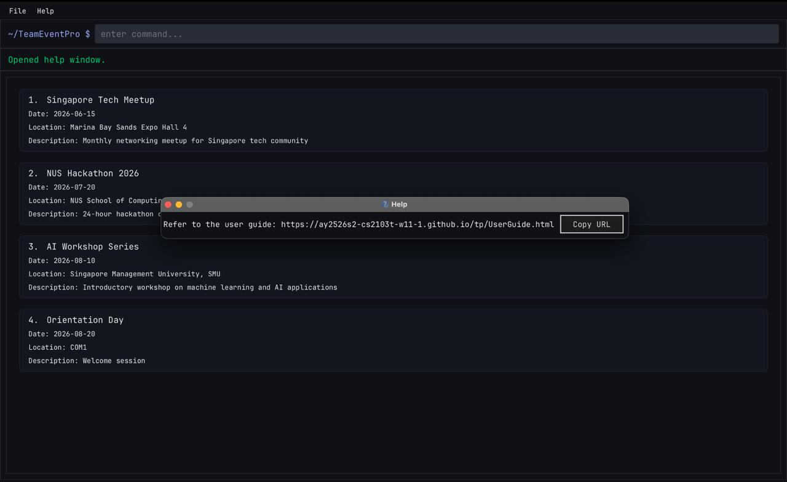

#### Notes
- Can be used in any mode.

---

## 2. List Command

Used to list all events or all participants depending on the current mode.

#### Format
`list`

#### Example Usage
Outside an event:

```
list
```

Inside an event:

```
list
```

#### Successful Execution
Outside an event: `Listed all events`

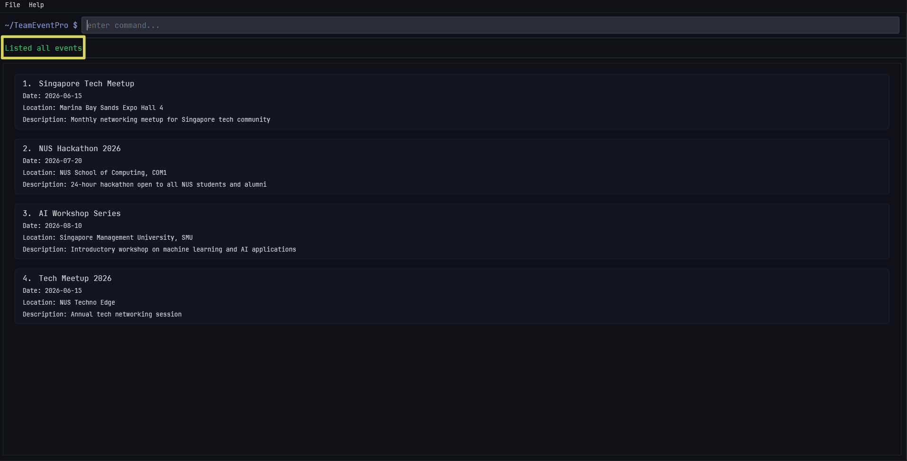

Inside an event: `Listed all participants`

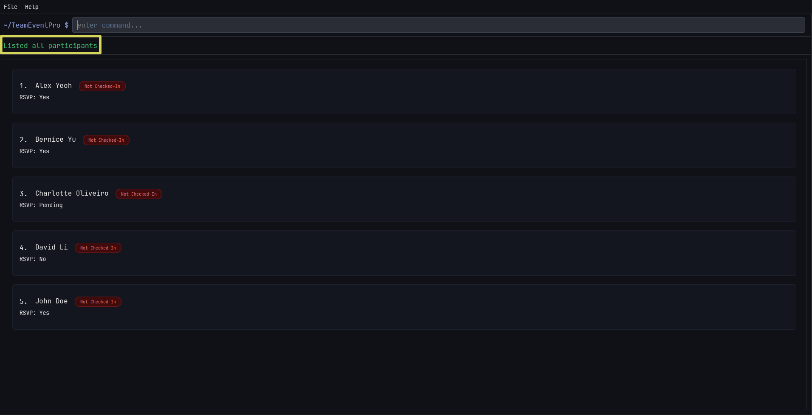

#### Notes
- Works differently depending on the current mode.

---

## 3. Search Command

Used to search for matching events or participants depending on the current mode.

#### Format
`search KEYWORD [MORE_KEYWORDS]`

#### Example Usage
Outside an event:

```
search Tech
```

Inside an event:

```
search John Doe
```

#### Successful Execution
Outside an event: matching events are shown in the event list.

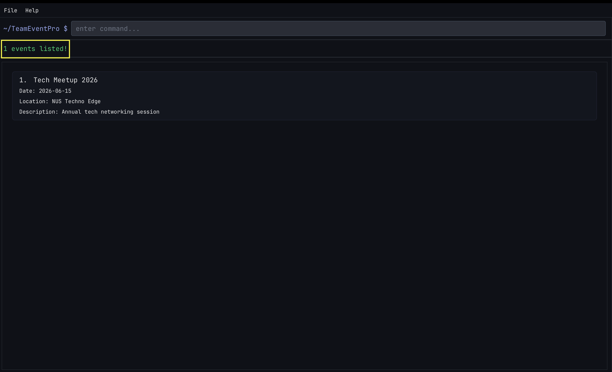

Inside an event: matching participants are shown in the participant list.

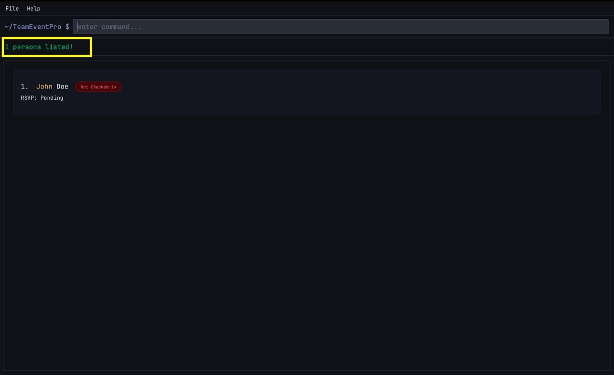

#### Notes
- Can be used in any mode.
- The results depend on the current mode.
- Outside an event, `search` checks event name, date, location, and description.
- Inside an event, `search` checks participant name, phone, address, email, team, GitHub username, and check-in status.
- Matching is case-insensitive and works on substrings.

---

## 4. Switch Theme Command

Used to switch the application theme.

#### Format
`switchtheme THEME`

#### Example Usage
```
switchtheme light
```

#### Successful Execution
`Switched to light mode.`

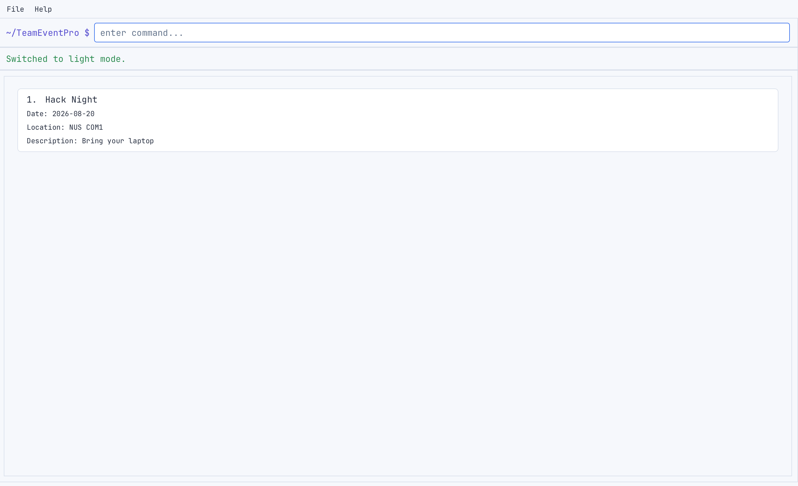

#### Notes
- Can be used in any mode.
- Only `dark` and `light` are valid values.

---

# Event Commands

This page describes commands that are primarily used while you are outside an event and managing the event list.

---

## 1. Event Creation and Setup

### 1.1 Add Event Command
<a id="cmd-addevent"></a>

Used to add an event to the event list by specifying the name, date, and optional details such as location and description.

#### Format
`addevent n/EVENT_NAME d/DATE [l/LOCATION] [desc/DESCRIPTION]`

#### Example Usage
```
addevent n/Tech Meetup 2026 d/2026-06-15 l/NUS Techno Edge desc/Annual tech networking session
```

#### Successful Execution


#### Notes
- Can only be used outside an event.
- `NAME` must start with an alphanumeric character, followed by any printable characters (including spaces and special characters such as `+`, `-`, `&`, `'`). It must not be blank.
- `DATE` must follow the format `YYYY-MM-DD` e.g. `2026-06-15`.
- `LOCATION` and `DESCRIPTION` are optional.
- Event names are case-sensitive.
- Duplicate-looking event names may still be valid because related sessions can happen at different locations or at different times on the same day.

---

## 2. Event Maintenance

### 2.1 Edit Event Command
<a id="cmd-editevent"></a>

Used to edit one or more selected details of an existing event in the event list.

#### Format
`editevent INDEX [n/EVENT NAME] [d/DATE] [l/LOCATION] [desc/DESCRIPTION]`

#### Example Usage
Edit multiple fields:

```
editevent 1 n/Hack Night d/2026-08-20 l/NUS COM1 desc/Bring your laptop
```

Edit only the location:

```
editevent 1 l/NUS COM2
```

Edit only the description:

```
editevent 1 desc/Updated event description
```

#### Successful Execution

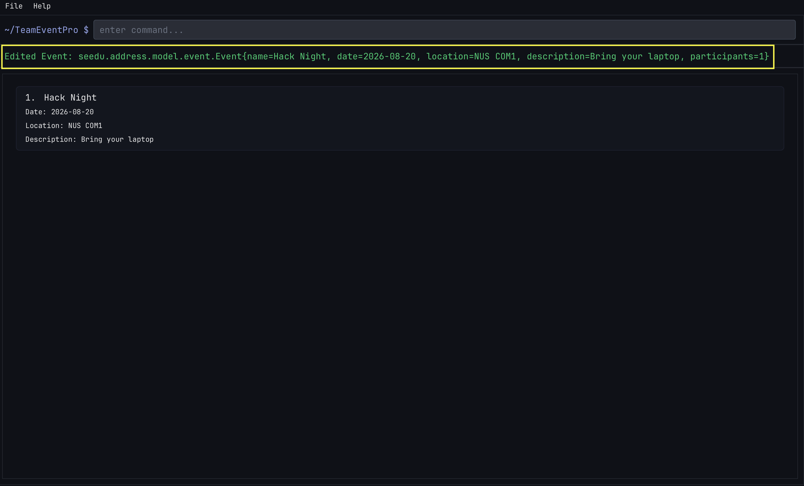

#### Notes
- Can only be used outside an event.
- Index must be a positive integer.
- You only need to provide the field or fields you want to edit. Fields not specified in the command will remain unchanged.
- At least one field to edit must be provided.
- Location can be cleared with `l/` followed by no location text. Trailing spaces are ignored, so `l/ ` also clears the location.
- Description can be cleared with `desc/` followed by no description text. Trailing spaces are ignored, so `desc/ ` also clears the description.

### 2.2 Delete Event Command
<a id="cmd-deleteevent"></a>

Used to delete an event from the event list. The participant list stored under that event is deleted together with it.

#### Format
`deleteevent INDEX`

#### Example Usage
```
deleteevent 1
```

#### Successful Execution

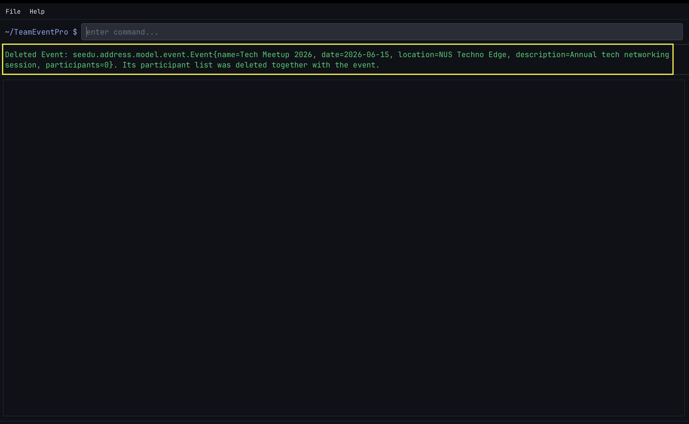

#### Notes
- Can only be used outside an event.
- Index must be a positive integer.
- Use this command carefully because the event's participant list is also removed.

---

## 3. Event Navigation

### 3.1 Enter Event Command
<a id="cmd-enter-event"></a>

Used to enter an event and switch into participant-management mode for that event.

#### Format
`enter event INDEX`

#### Example Usage
```
enter event 1
```

#### Successful Execution


#### Notes
- Can only be used outside an event.
- Index must be a positive integer.
- You must leave the current event before entering another one.

---

## 4. Application Exit

### 4.1 Exit Command
<a id="cmd-exit"></a>

Used to close the application.

#### Format
`exit`

#### Example Usage
```
exit
```

#### Successful Execution
The application is exited.

#### Notes
- This command only succeeds outside an event.
- If you are currently inside an event, leave it first before exiting.

---

# Participant Commands

This page describes commands that are used while you are inside an event and managing that event's participants.

See [Command Fundamentals](#command-fundamentals) for command syntax, prefix rules, index behavior, and common input mistakes.

---

## 1. Participant Management

### 1.1 Add Command
<a id="cmd-add"></a>

Used to add a participant to the currently entered event.

#### Format
`add n/NAME p/PHONE e/EMAIL a/ADDRESS [team/TEAM] [g/GITHUB_USERNAME] [r/RSVP_STATUS] [t/TAG]...`

#### Example Usage
```
add n/John Doe p/98765432 e/johnd@example.com a/311, Clementi Ave 2, #02-25 team/Development g/johndoe r/yes t/friends
```

#### Successful Execution
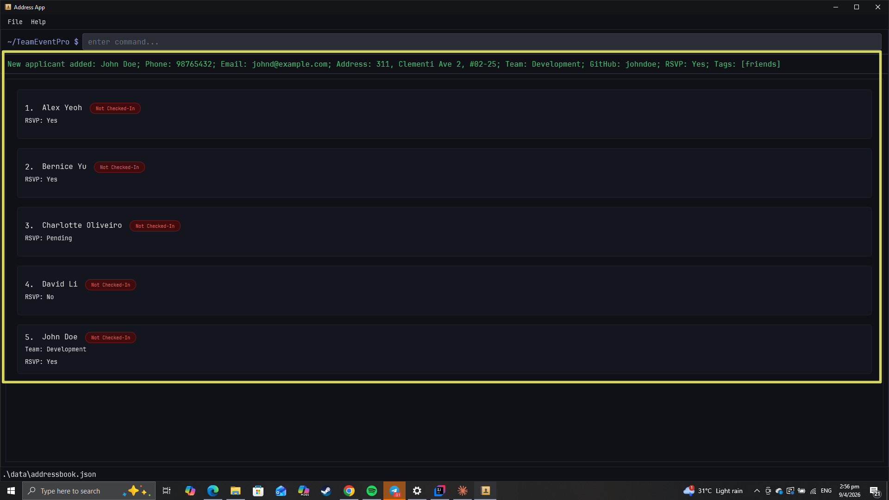

#### Notes
- Can only be used inside an event.
- Name, phone, email, and address are required.
- `NAME` can contain alphanumeric characters (including accented characters e.g. José, Tomáš), spaces, apostrophes (`'`), hyphens (`-`), and forward slashes (`/`) e.g. `O'Brian`, `s/o Kumar`. Names cannot exceed 100 characters.
- `PHONE` must contain only digits, and be between 3 and 17 digits long.
- `RSVP_STATUS` must be `yes`, `no`, or `pending` (case-insensitive). Defaults to `pending` if not provided.
- `TEAM` must be alphanumeric and at most 15 characters.
- `EMAIL` must satisfy the app's email format rules and **must not exceed 64 characters** (inclusive).
- `ADDRESS` must not be blank (after trimming) and **must not exceed 100 characters** (inclusive).
- Two participants are considered duplicates if they share the same name (case-insensitive) and either the same phone number or the same email. Duplicate participants cannot be added to the same event.

### 1.2 Edit Command
<a id="cmd-edit"></a>

Used to edit the details of an existing participant in the current event.

#### Format
`edit INDEX n/NAME p/PHONE e/EMAIL a/ADDRESS [g/GITHUB_USERNAME] [r/RSVP_STATUS] [team/TEAM] [t/TAG]...`

#### Example Usage
```
edit 1 p/91234567 e/johndoe@example.com
```

#### Successful Execution
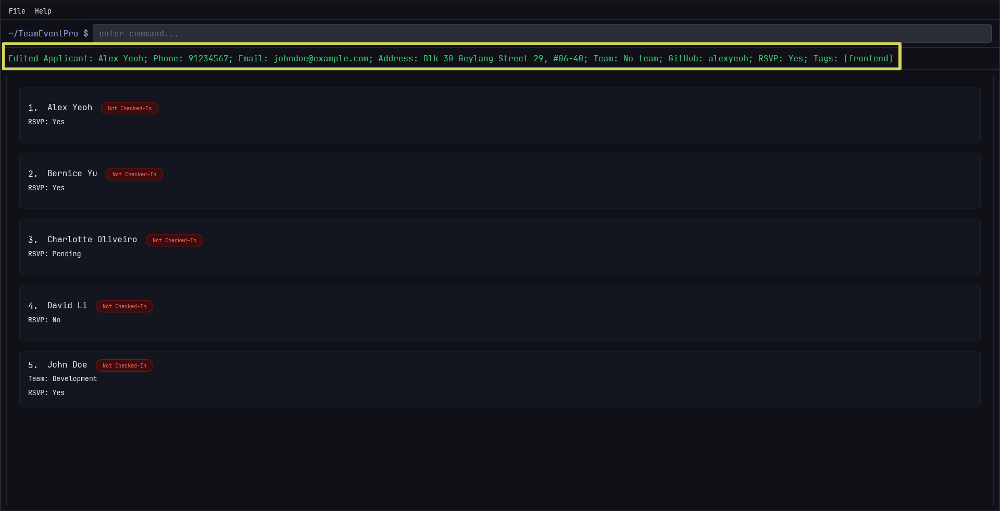

#### Notes
- Can only be used inside an event.
- Index must be a positive integer.
- At least one field to edit must be provided.
- Existing values will be overwritten by the new values.
- `NAME` follows the same constraints as the `add` command — alphanumeric characters (including accented), spaces, apostrophes, hyphens, and forward slashes. Cannot exceed 100 characters.
- `PHONE` must contain only digits, and be between 3 and 17 digits long.
- `RSVP_STATUS` must be `yes`, `no`, or `pending` (case-insensitive).
- `TEAM` must be alphanumeric and at most 15 characters.
- `EMAIL` follows the same rules as in `add` (valid format and at most 64 characters).
- `ADDRESS` follows the same rules as in `add` (non-blank after trimming, at most 100 characters).
- Clear all tags by typing `t/` with nothing after it.
- Clear the team by typing `team/` with nothing after it.
- Editing a participant to match another participant's name (case-insensitive) and phone or email will be rejected as a duplicate.

### 1.3 Delete Command
<a id="cmd-delete"></a>

Used to delete a participant from the current event.

#### Format
`delete INDEX`

#### Example Usage
```
delete 1
```

#### Successful Execution
`Deleted Participant: ...`

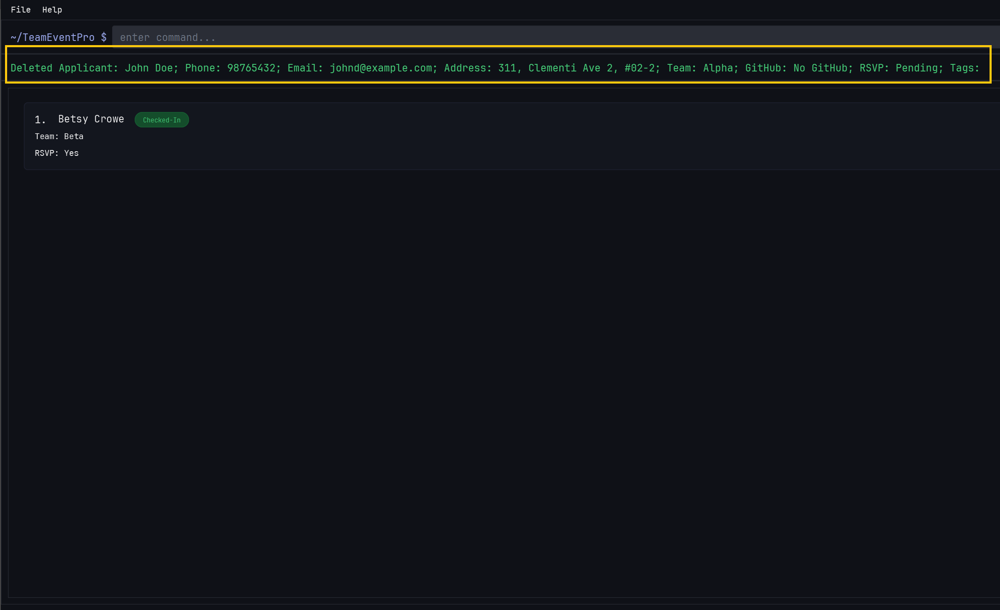

#### Notes
- Can only be used inside an event.
- Index must be a positive integer.

### 1.4 Clear Command
<a id="cmd-clear"></a>

Used to clear all participants from the current event.

#### Format
`clear`

#### Example Usage
```
clear
```

#### Successful Execution
`Address book has been cleared!`

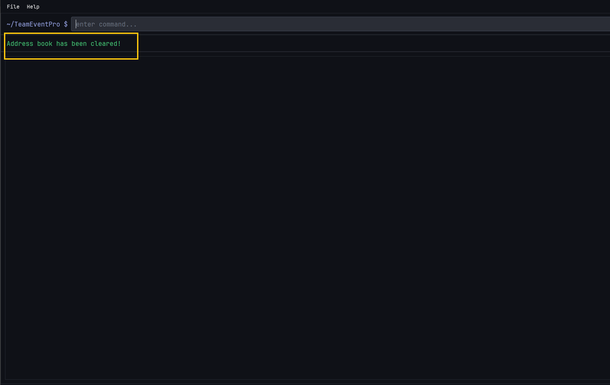

#### Notes
- Can only be used inside an event.
- This removes all participants from the current event.

---

## 2. Team and Attendance Management

### 2.1 Assign Team Command
<a id="cmd-assign"></a>

Used to assign a participant to a team.

#### Format
`assign INDEX team/TEAM_NAME`

#### Example Usage
```
assign 2 team/Alpha
```

#### Successful Execution
`Assigned [participant] to Team Alpha.`

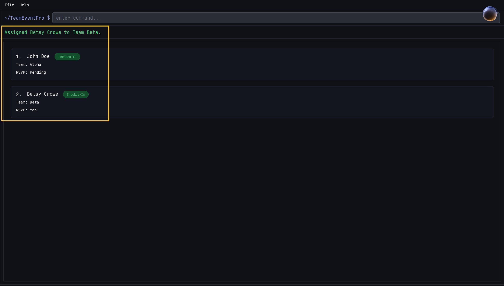

#### Notes
- Can only be used inside an event.
- Index must be a positive integer.
- Team names must be alphanumeric and at most 15 characters.

### 2.2 Check-In Command
<a id="cmd-checkin"></a>

Used to mark that a participant has physically arrived at the event.

This is different from RSVP status, which records whether the participant said they would attend.

#### Format
`checkin INDEX`

#### Example Usage
```
checkin 3
```

#### Successful Execution


#### Notes
- Can only be used inside an event.
- Index must be a positive integer.

---

## 3. Search, Filtering, and Viewing

### 3.1 Filter Command
<a id="cmd-filter"></a>

Used to filter the participant list using one criterion at a time.

#### Format

Use exactly **one** of the following :

- RSVP: `filter r/RSVP_STATUS`
- Tag: `filter t/TAG`
- Team: `filter team/TEAM_NAME`
- Check-in: `filter checkin/yes` or `filter checkin/no`

#### Example Usage

```
filter r/yes
filter t/python
filter team/Alpha
filter checkin/yes
```

#### Successful Execution


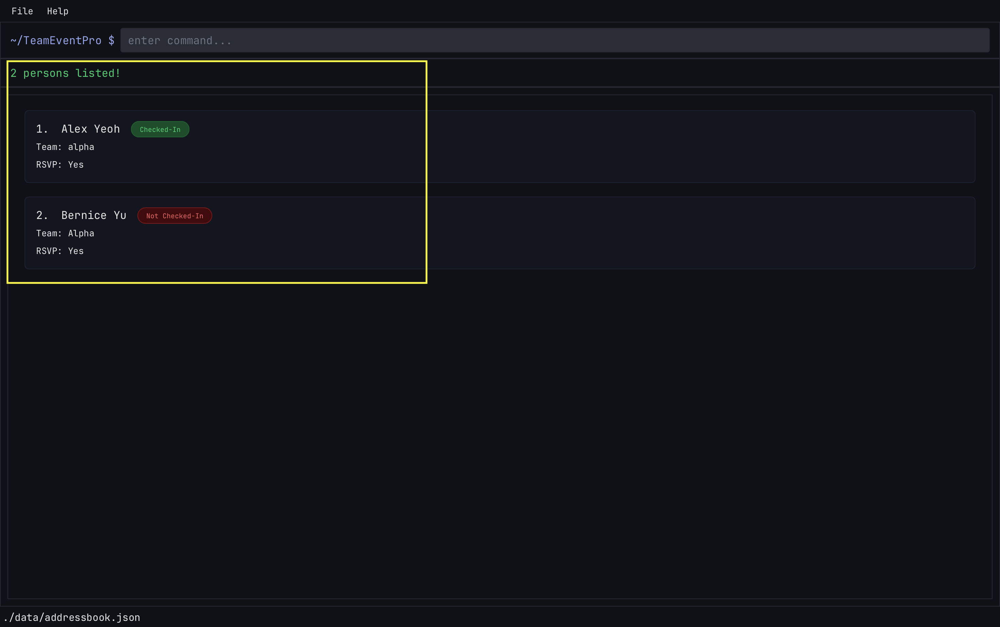

#### Notes
- Can only be used inside an event.
- Supported prefixes are `r/`, `t/`, `team/`, and `checkin/`.
- Only one filter criterion can be used per command (e.g., `filter r/yes t/python` is invalid).
- Filtering is not cumulative across commands; each `filter` command replaces the previous filter/search.
- `checkin/` accepts `yes` or `no`(case-insensitive).

### 3.2 View Command
<a id="cmd-view"></a>

Used to show the details of a selected participant.

#### Format
`view INDEX`

#### Example Usage
```
view 1
```

#### Successful Execution
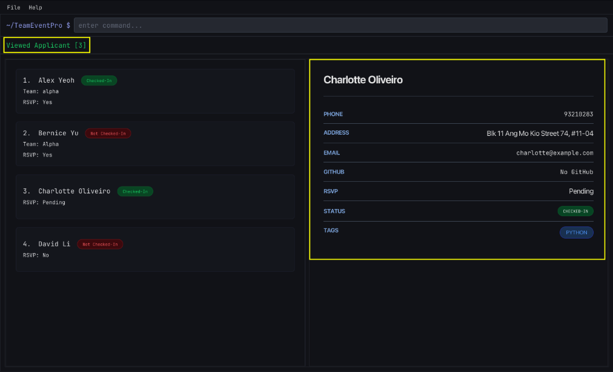


#### Notes
- This command can only be used inside an event.
- `INDEX` must be a positive integer.
- The `INDEX` must refer to a participant currently shown in the displayed list, including filtered or searched results.
- The command fails if the `INDEX` is invalid or out of range.

### 3.3 Statistics Command
<a id="cmd-statistics"></a>

Used to display the current event's participant statistics summary.

#### Format
`statistics`

#### Example Usage
```
statistics
```

#### Successful Execution
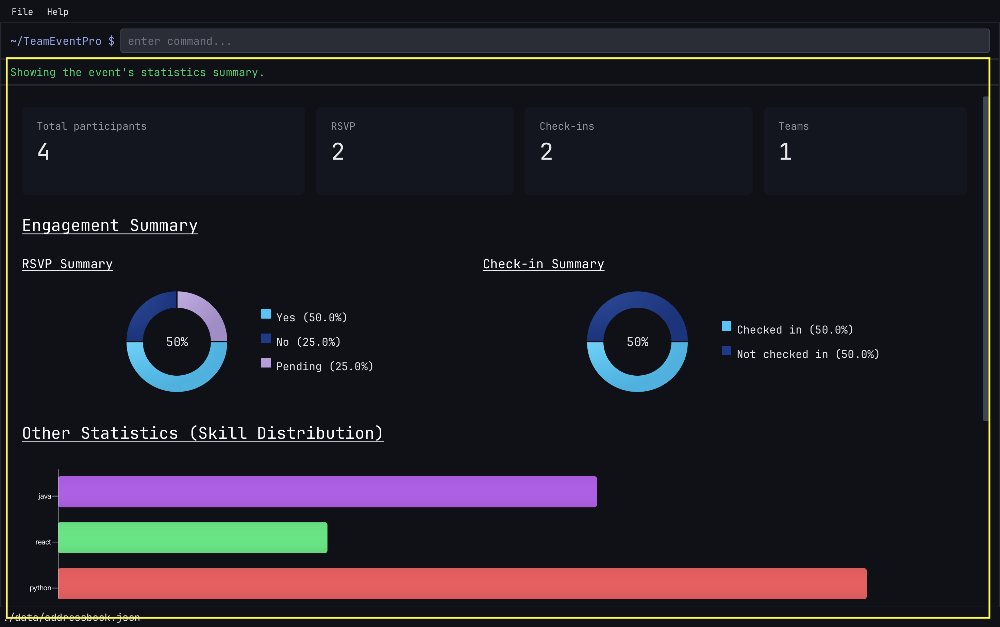

#### Notes
- Can only be used inside an event.
- This is a read-only command; it does not edit participant data.
- If you want to return to normal participant list operations, use commands like `list`, `filter`, `search`, etc.
- The command format is `statistics` only (no index or prefixes needed).

---

## 4. Import and Export

### 4.1 Import Command
<a id="cmd-import"></a>

Used to import participants from a CSV file into the current event.

Before using `import`, ensure your CSV has the expected header format:

- Required header columns: `name,phone,email,address`
- Optional header columns: `team,github,rsvpStatus,tags,checkinStatus`
- If optional columns are included, append them after the required columns in the order shown above.

#### Format
`import [FILE_PATH]`
`import list`

#### Path Rules
- Relative paths are resolved from the app's working folder (where the JAR is run).
- Absolute paths are supported.
- Windows absolute path examples: `C:/Users/Alex/tp/data/export/hacknight.csv` or `C:\\Users\\Alex\\tp\\data\\export\\hacknight.csv`
- macOS absolute path example: `/Users/alex/tp/data/export/hacknight.csv`

#### Example Usage
```text
import data/export/hacknight.csv
```

To list discoverable CSV files:

```text
import list
```


Absolute path examples:

```text
import C:/Users/Alex/tp/data/export/hacknight.csv
import /Users/alex/tp/data/export/hacknight.csv
```

#### Successful Execution
Participants from the CSV file are imported into the current event. Invalid rows and duplicates are skipped and reported.

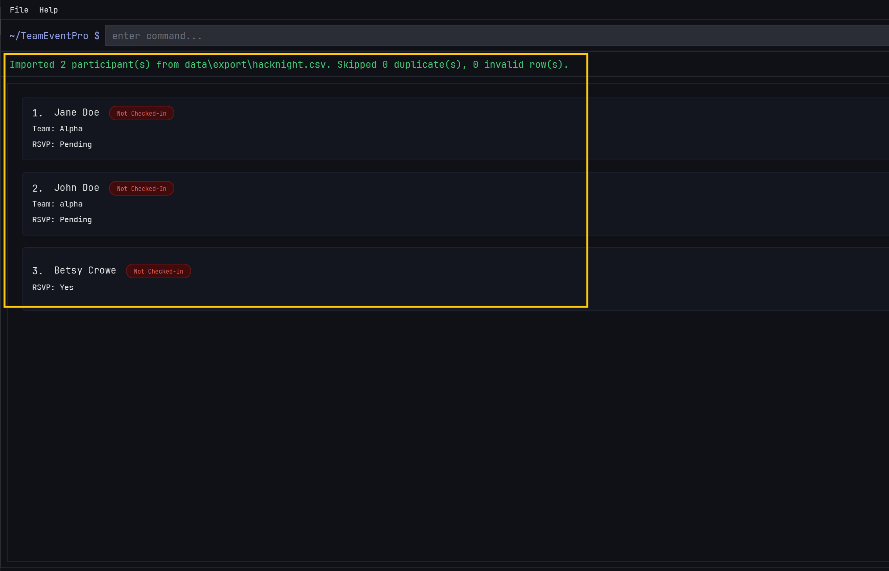

#### Notes
- Can only be used inside an event.
- Only `.csv` files are supported.
- `import list` shows discoverable CSV files.
- `import` with no parameters behaves the same as `import list`.

### 4.2 Export Command
<a id="cmd-export"></a>

Used to export participants from the current event to a CSV file.

#### Format
`export [FILE_PATH]`

#### Path Rules
- Relative paths are resolved from the app's working folder (where the JAR is run).
- Absolute paths are supported.
- Windows absolute path examples: `C:/Users/Alex/tp/data/exports/hacknight.csv` or `C:\\Users\\Alex\\tp\\data\\exports\\hacknight.csv`
- macOS absolute path example: `/Users/alex/tp/data/exports/hacknight.csv`

#### Example Usage
```text
export data/ForTestOnly.csv
```

To export using the default path:

```text
export
```

Absolute path examples:

```text
export C:/Users/Alex/tp/data/exports/hacknight.csv
export /Users/alex/tp/data/exports/hacknight.csv
```

#### Successful Execution
`Exported ... participant(s) to ...`


Default-path export result:


#### Notes
- Can only be used inside an event.
- Only `.csv` files are supported.
- If no file path is provided, the default export path is used.
- If the target file already exists, the app exports to a timestamped file instead.

---

## 5. Event Navigation

### 5.1 Leave Event Command
<a id="cmd-leave-event"></a>

Used to leave the current event and return to the event list.

#### Format
`leave event`

#### Example Usage
```
leave event
```

#### Successful Execution

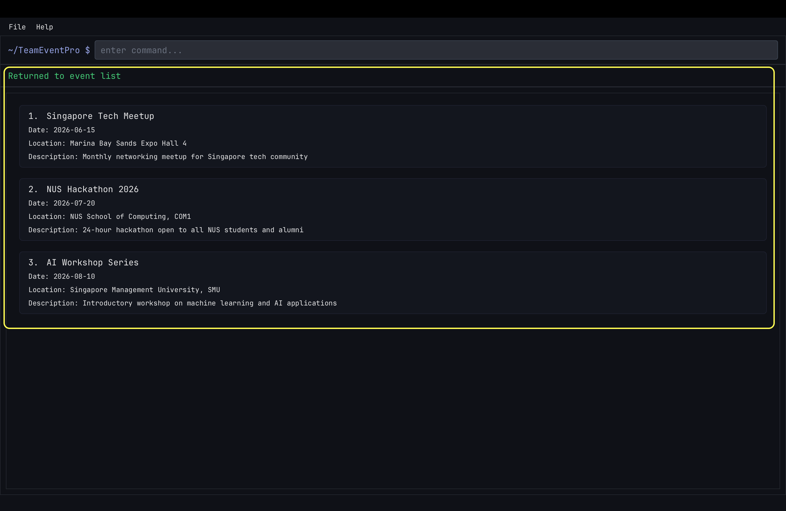

#### Notes
- Can only be used inside an event.
- Ensure that there is no space after `event`.

---

# Known Issues

## 1. Participant command errors outside an event may show format errors first

If a participant-related command such as `add`, `edit`, `delete`, `assign`, `checkin`, or `filter` is entered
outside an event with an invalid format, the app may first show a command format error instead of telling the
user to enter an event first.

This happens because the command input is parsed before the app checks whether the user is currently inside an
event. As a result, malformed input can fail at the parser stage before the mode-related validation is reached.

## 2. Undo is not fully supported for some data-changing operations

Some operations do not currently support undo correctly. Examples include `checkin`, `clear`, `delete`, and
`deleteevent`.

Once these commands are executed, there may be no built-in way to restore the previous state through an undo
command. Users should therefore be careful when performing destructive or state-changing actions, especially
when clearing participants or deleting events.

## 3. Commands do not auto-clear after an error

If a command fails, the command text may remain in the command box instead of clearing automatically.

This means users may need to manually edit or remove the failed command before trying again. This is mainly a
usability issue, but it can be slightly inconvenient when testing multiple command variations in a row.

## 4. A corrupted or unreadable `eventbook.json` can be overwritten on the next save

TeamEventPro stores events and their participants together in `data/eventbook.json` (each event has a `participants`
list). This issue applies when the app **fails to load that file at all**—for example the JSON is **syntactically
invalid** or the file is incomplete, or **required** event or participant data cannot be converted into the app’s
model (invalid name, phone, email, address, and similar). That is **not** the same as every typo in the file: some
optional fields are adjusted without failing the load; that case is covered in the next issue.

In that situation the application **does not stop**, and there is **no** blocking dialog that loading failed. 
Startup continues with an **empty** event list in memory while the failure is recorded in the log. That design 
avoids a hard crash, but it means the next successful command **saves** that in-memory state back to disk and
can **overwrite** the original `eventbook.json`, which can **erase** your previous events and participants in one
step.

**What we recommend:** copy `data/eventbook.json` aside before you edit it by hand or if you think it may already be
damaged. If the app has opened with an empty event list, avoid running commands until you **restore** a known-good
copy of the file and **restart** TeamEventPro so it loads the repaired data from scratch.

## 5. Some optional participant fields are silently normalised on load

Not every bad value in a participant record prevents the file from loading. For **GitHub** and **RSVP status**, invalid
strings are mapped to safe defaults instead of failing conversion: invalid GitHub becomes *no GitHub* (shown like an
empty or “none” value in the UI), and an invalid `rsvpStatus` becomes **pending**.

That leniency is intentional—it **reduces friction** for organisers when data is slightly wrong, and you can fix the
participant inside the app. Required fields and other optional fields still fail fast if they are invalid.

**What we recommend:** keep a **backup** of `eventbook.json` before manual JSON edits or risky imports. If RSVP or
GitHub looks wrong after load, **edit** the participant in TeamEventPro or restore from backup rather than assuming the
file still contains the old text. Using **commands or CSV import** instead of raw JSON helps keep values within the
documented rules.

## 6. Phone numbers do not accept country codes or symbols

The `p/` field only allows **digits** (at least three), with **no** plus sign, spaces, or dashes. That keeps parsing and
storage simple and matches the current user guide, but it is **stricter than many people expect**: numbers such as
`+65 9123 4567` or `+6591234567` are **rejected** even though they are realistic in everyday use.

**What we recommend:** enter the **national** number without the country prefix (for example digits only, as in the
command examples).
