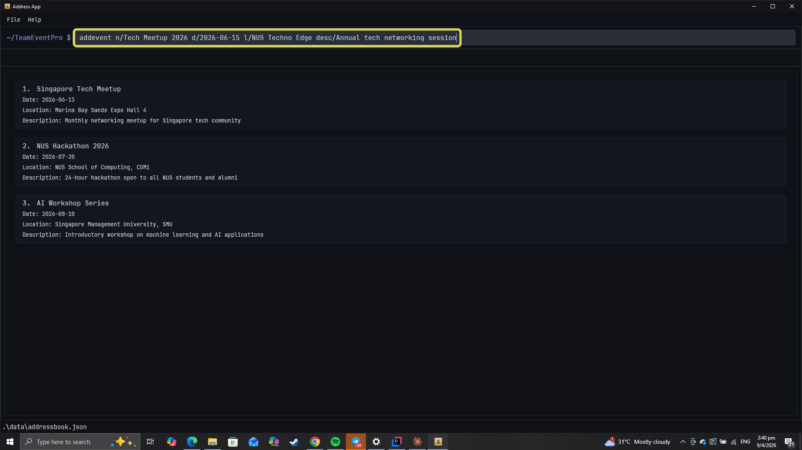
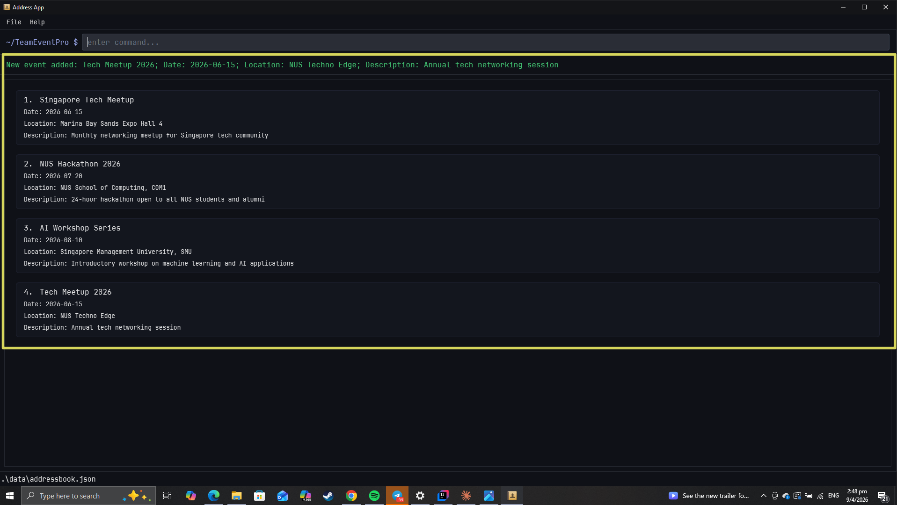

# Event Commands

This page describes commands that are primarily used while you are outside an event and managing the event list.

---

## 1. Event Creation and Setup

### 1.1 Add Event command

Used to add an event to the event list by specifying the name, date, and optional details such as location and description.

#### Format
`addevent n/[EVENT NAME] d/[DATE] [l/LOCATION] [desc/DESCRIPTION]`

#### Example Usage
`addevent n/Tech Meetup 2026 d/2026-06-15 l/NUS Techno Edge desc/Annual tech networking session`


#### Successful Execution
`New event added: ...`


#### Notes
- Can only be used outside an event.
- `NAME` must start with an alphanumeric character and can only contain alphanumeric characters and spaces. It must not be blank.
- `DATE` must follow the format `YYYY-MM-DD` e.g. `2026-06-15`.
- `LOCATION` and `DESCRIPTION` are optional.
- Duplicate events with the same name are not allowed.

---

## 2. Event Maintenance

### 2.1 Edit Event command

Used to edit the details of an existing event in the event list.

#### Format
`editevent [INDEX] [n/EVENT NAME] [d/DATE] [l/LOCATION] [desc/DESCRIPTION]`

#### Example Usage
`editevent 1 n/Hack Night d/2026-08-20 l/NUS COM1 desc/Bring your laptop`

#### Successful Execution
`Edited Event: ...`

#### Notes
- Can only be used outside an event.
- Index must be a positive integer.
- At least one field to edit must be provided.
- Location can be cleared with `l/`.
- Description can be cleared with `desc/`.

### 2.2 Delete Event command

Used to delete an event from the event list. The participant list stored under that event is deleted together with it.

#### Format
`deleteevent [INDEX]`

#### Example Usage
`deleteevent 1`

#### Successful Execution
`Deleted Event: ... Its participant list was deleted together with the event.`

#### Notes
- Can only be used outside an event.
- Index must be a positive integer.
- Use this command carefully because the event's participant list is also removed.

---

## 3. Event Navigation

### 3.1 Enter Event command

Used to enter an event and switch into participant-management mode for that event.

#### Format
`enter event [INDEX]`

#### Example Usage
```
enter event 1
```


#### Successful Execution


#### Notes
- Can only be used outside an event.
- Index must be a positive integer.
- You must leave the current event before entering another one.

---

## 4. Application Exit

### 4.1 Exit command

Used to close the application.

#### Format
`exit`

#### Example Usage
```
exit
```


#### Successful Execution
The application is exited.

#### Notes
- This command only succeeds outside an event.
- If you are currently inside an event, leave it first before exiting.

---

## 5. Navigation

- [Back to Introduction, Modes, and Common Commands](UG.md)
- [Back to Common Commands](UserGuideCommonCommands.md)
- [Back to Command Fundamentals](UserGuideCommandFundamentals.md)
- [Go to Participant Commands](UserGuideParticipants.md)
